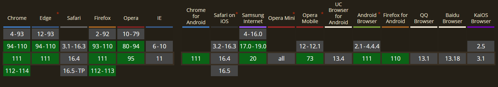

  
	
	
	
	

		<em>Developed with the software and tools below.</em>

	
	
	
	
	
	
	
	
	
	
	
	
	
	
	
	
	
	
	
	
	
	
	
	
	
	
	
	

<!--  -->

  
<a href="https://github.com/siyuan-note/siyuan">思源（SiYuan）</a> | <a href="README_Sillot.md">汐洛（Sillot）</a>

## 📚 文档

<h2>正常访问<a href="https://sillot.db.sc.cn/"> https://sillot.db.sc.cn/ </a></h2>
<h2>代理访问<a href="https://sillot-docs.db.sc.cn/"> https://sillot-docs.db.sc.cn/ </a></h2>

  

   

## 🔭 Roadmap

<h2><a href="https://github.com/orgs/Hi-Windom/projects/2/views/2">汐洛路线图（Sillot Roadmap）</a></h2>
<h2><a href="https://github.com/orgs/Hi-Windom/projects/3/views/2">汐洛安卓路线图（Sillot Android Roadmap）</a></h2>
<h2><a href="https://github.com/orgs/Hi-Windom/projects/4/views/2">汐洛社区路线图（Sillot Community Roadmap）</a></h2>

  

   

## 🌐 兼容性

  

   

## 🛠️ 贡献者

