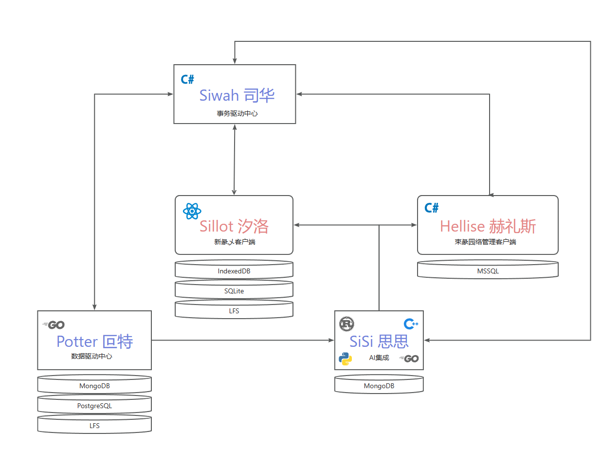

<a href="README_zh_CN.md">思源（SiYuan）</a> | 汐洛（Sillot）

## About

Sillot （汐洛）是彖乄驱动、极致优雅、开发者友好的思源笔记 Branch（分支）

汐洛归口海司计科菲，由以下单位协作研发：

1. 绛亽编程自律协芔
2. 衍丫融创衍乆艼
3. 衍丫彖综衍乆艼
4. 衍丫亽律衍乆艼
5. 东兮二心可亊乄亍

感谢以下单位的支持：

1. 绛亽符文自妍协芔
2. 绛亽战略自妍协芔
3. 文兮秋海棠亊乄亍
4. 文兮天启亊乄亍
5. 东兮灵龙亊乄亍
6. 东兮业华亊乄亍

## 彖乄驱动

汐洛始终代表先进恣产力，始终拥护全球先进开源力量，坚定不移推动新彖乄面向未来持续发展。

## 极致优雅

> 注：汐洛刚立项时，确立的是【开发者友好、社区优先、彖乄驱动】总方针。但遗憾的是，汐洛并未得到思源笔记社区的认可，我们无奈移除 “社区优先”。
>
> 以 v0.11 版本为标志，汐洛彻底移除“社区分支”定位，不再对思源笔记社区负责，开始了自己的漫漫探索之路。感谢思源笔记的孵化与长期支持。

汐洛始终坚持精品路线，从不在任何一个细节上妥协。专注于为目标用户提供最好的使用体验，这是实现极致优雅的必由之路。汐洛尊重非目标用户的声音，但并不关心。

## 开发者友好

汐洛有自己的开发路线、技术选型与工具链体系，同时受海文东标准约束，无论是贡献开发者还是第三方扩展开发者都不会感到困惑。

